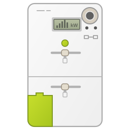

  

# GridPilot

GridPilot is een Home Assistant integratie voor energiebeheer, gericht op het bewaken en zo laag mogelijk houden van het capaciteitstarief. Daarnaast biedt GridPilot ondersteuning voor het beheer van thuisbatterijen, zonne-energieproductie en het laden van elektrische voertuigen. De integratie combineert een veilige rekenmodule met een compacte dashboardkaart voor het visualiseren van batterij- en energiestromen.

GridPilot is a Home Assistant energy management integration focused on monitoring and minimizing the capacity tariff. It also provides support for managing home batteries, solar energy production, and EV charging. The integration combines a safe calculation engine with a compact dashboard card for visualizing battery and energy flows.

## Current status

Version `0.2.0` is a public preview. It remains in shadow mode by default.
Battery setpoint actuation can be enabled explicitly from the integration options
after the existing battery controller has been disabled.

## Initial features

- UI-only configuration through a Home Assistant config flow.
- Generic entity mapping with a Victron-oriented preset.
- Integration-owned grid-power and battery-curve options without helpers.
- Calculated grid setpoint and operating-mode sensors.
- Measurement-validity binary sensor.
- Bundled `custom:gridpilot-card` frontend card.
- Dutch and English translations.

## Manual development installation

Copy `custom_components/gridpilot` into the Home Assistant configuration
directory under `custom_components`, restart Home Assistant, and add GridPilot
from **Settings > Devices & services**.

Keep the existing controller enabled while comparing GridPilot in shadow mode.
Disable it before enabling GridPilot's active battery control.

## Planned releases

- `0.3`: PV surplus and EV current control.
- `0.4`: battery-to-EV and manual charging modes.
- `1.0`: stable migration and public HACS release.

## License

MIT
